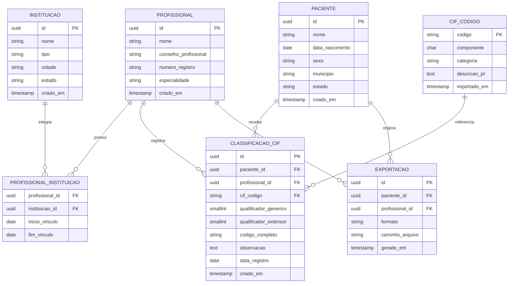

# Banco de Dados e Interface para Organização de Informações em Saúde com base na CIF

**Autoras:** Carine Guzzi Santos e Larissa de Souza Fontes  
**Orientador:** Prof. Dr. Chi Nan Pai  
**Escola Politécnica — USP — TCC 2026**

---

---

## Decisões de arquitetura

**PostgreSQL** foi escolhido em vez de SQLite por suportar múltiplos usuários simultâneos, múltiplas instituições e armazenamento em servidor dedicado.

**Snapshot local da CIF** — os códigos são importados via API da OMS e armazenados na tabela `cif_codigo`. Isso garante funcionamento offline e independência de conectividade durante o uso clínico.

**Qualificadores separados** — o qualificador genérico (0–4) e o extensor ficam em colunas distintas para permitir consultas analíticas (ex: filtrar casos graves). O campo `codigo_completo` armazena o código no formato padronizado da CIF (ex: `b1301.2_3`) para uso em relatórios e exportações.

**Vínculo profissional–instituição** — modelado como tabela de junção com data de início e fim, preservando o histórico mesmo quando um profissional muda de instituição.
